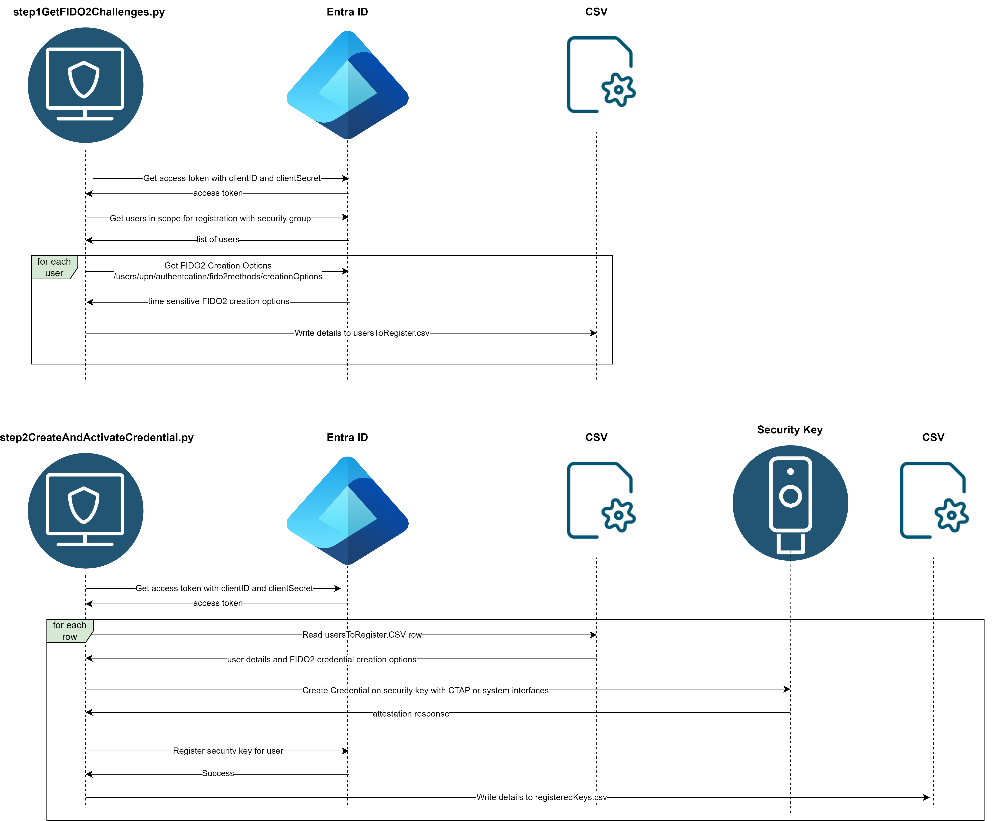

# entraId-register-passkeys-on-behalf-of-users - Bulk Registration
- This project will use Microsoft Graph APIs to provision FIDO2 credentials on a FIDO2 security key. 
- This project is an unsupported proof of concept.
- This project is a simplistic demonstration of how to use the Microsoft Graph APIs to bulk register FIDO2 security keys with a CTAP client for Entra ID users.
- This script uses the [python-fido2](https://github.com/Yubico/python-fido2) ctap library for creation of credentials on a security key.

## Flow 
In this proof of concept, the registration flow is broken up into 2 scripts to support the manual bulk processing of the registration of security keys. 
One script is run to get all the users that are in scope for processing and to retrieve FIDO2 credential creation options for each one of them. 
The second script is run to create the credentials on security keys and then register and activate the credentials in Entra ID.

### Detailed Flow

### Script 1
The first script `bulkRegistrationGetFIDO2Challenges.py` will be used to:
1. Get a list of users that are in scope for enrollment of FIDO2 credentials. This is currently controlled by membership in a group name that is set in the `configs.json` file. 
2. For each of the members of the group, the script will call the Graph API for
  `/users/{userPrincipalName | id}/authentication/fido2Methods/creationOptions`
  This endpoint will return FIDO2 credential creation parameters. These details will later be used to create a credential on a YubiKey. 
3. The script writes the relevant details to a csv file. 

### Script 2
The second script `bulkRegistrationCreateAndActivateCredential.py` will be used to:
1. Process the csv file one by one to:
    1. Use the csv to build the fido2 credential creation parameters to create a credential on a YubiKey.
    2. Get the response from the YubiKey and call the Graph API for:
    `/users/{userPrincipalName | id}/authentication/fido2Methods`
    This endpoint will assign and activate the FIDO2 credential to the user's profile in Entra ID.
2. The script will also write a row to a csv file that has the userPrincipalName, entra object id for the registration, serial number if available, and also PIN if the PIN was randomly generated by the script.

## Setup
1. Register an application in the Entra ID App Registrations blade
    1. Note the `Application (client) ID` that is generated when the application is created.  This will be used in step 2 as the `client_id`
    2. Navigate to API permissions and add the following application permissions for Microsoft Graph.(Make sure that you do not select Delegated Permissions) : 
        - UserAuthenticationMethod.ReadWrite.All
        - Group.Read.All
        - Directory.Read.All
    3. Grant admin consent for the above permissions.
    4. Navigate to Certificates & secrets and add a new Client secret.
        - Ensure that you record the `Value` that is displayed when you create the new secret.  This will be used in step 2 as the `client_secret`
2. Populate the `configs.json` config file contents with appropriate tenant name, credentials and Entra group name, as well as the `client_id` and `client_secret` from the previous step.
    Specifics about the `config.json` file.
    | Config | Description | 
    |-----------|-------------|
    |tenantName | Required. Set with the Entra ID tenant name|
    |client_id | Required. Set with the registered application appId/clientID in Entra ID.|
    |client_secret| Required. Set with the client secret for the registered application in Entra ID.|
    |usersInScopeGroup| Required. An Entra ID Security group name that has all the users that are in scope for FIDO2 security key registration.|
    |challengeTimeoutInMinutes| Required. The number of minutes the Entra ID issued FIDO2 challenge should be valid for. Used to allow for extended processing times between the point where the challenge is requested and the registeration of the credential with EntraID|
    |deleteExistingUserFIDOCredentials| Required. A boolean indicating whether existing FIDO2 keys registered for the user in Entra ID should be deleted before registering new FIDO2 credentials.|
    |useRandomPIN| Required. Set to *false* if using a security key with existing PIN and you prefer to let the platform prompt you for PIN. When using false some platforms will require a PIN to be set first. Script will set random 6 digit PIN if set to `true`.  Warning if setting a random PIN make sure not to lose track of the random PIN or the security key may need to be reset. |    
3. `pip install fido2`
4. `pip install requests`
5. `pip install yubikey-manager`

### Other setup considerations
1. While not explicitly required, it is suggested that you use a security key that you can reset without risk of locking out of any accounts where you have registered the security key. 
2. Depending on the `useRandomPIN` value in `configs.json` the script may set a random PIN. If that random PIN is then lost, the security key may need to be reset. 
3. Read the below *Tested Configurations* section to understand how different platforms, key configurations, and `configs.json` configurations may behave.  
4. The scripts have mostly been tested with YubiKeys, but other vendors' security keys have also been tested. Other vendors products may not fully work with all features of the script since there are some dependencies on Yubikey Manager software when attempting to set YubiKey PINs and determining YubiKey serial numbers so those features will not work if using security keys from other vendors. The script will work with other security key vendors' products if using `"useRandomPIN": false` and if the security key already has a PIN set.  
5. Any security key that is used with this script must also be supported by Microsoft. See https://learn.microsoft.com/en-us/entra/identity/authentication/concept-authentication-passwordless#fido2-security-key-providers

#### Tested configurations:
| Platform | PIN configured on key | configs.json setting | Result |
|-----------|-----------|-----------|-----------| 
| Windows admin-mode | PIN not set| useRandomPIN=false | Not supported configuration |
| Windows admin-mode | PIN not set| useRandomPIN=true | Script will set a random PIN |
| Windows admin-mode | PIN set| useRandomPIN=false | Script will prompt for existing PIN |
| Windows admin-mode | PIN set| useRandomPIN=true | Script will prompt for current PIN and change to new random PIN |
| Windows non-admin | PIN not set| useRandomPIN=false | Windows Security message will prompt user to set PIN |
| Windows non-admin | PIN not set| useRandomPIN=true | useRandomPIN ignored. Windows Security message will prompt user to set PIN  |
| Windows non-admin | PIN set| useRandomPIN=false | Windows Security message will prompt for existing PIN |
| Windows non-admin | PIN set| useRandomPIN=true | useRandomPIN ignored. Windows Security message will prompt for existing PIN |
| macOS | PIN not set| useRandomPIN=false | Not supported configuration |
| macOS | PIN not set| useRandomPIN=true | Script will set a random PIN |
| macOS | PIN set| useRandomPIN=false | Script will prompt for existing PIN |
| macOS | PIN set| useRandomPIN=true | Script will prompt for current PIN and change to new random PIN |

## How to run
1. Open terminal.  Notes about running on Windows.
    1. When running the script without administrative privileges, the WinAPI is used (webauthn.dll). This has different behaviors and capabilities than when running the script in admin mode. 
       Besides the user interface differences, it should be noted that some extensions like credProtectionPolicies cannot be set using webauthn.dll. Entra ID specifically requests credProtect policy level 1 (aka optional) when creating FIDO2 credentials.  This doesn't get explicitly set when using webauthn.dll. Note that the default behavior for the YubiKey is to use Level 1 if not explicitly set so effectively the results are similar.  Also note that the configs.json `userRandomPIN` will be ignored if enabled and the user will be prompted to set a PIN during registration instead of using a randomly generated one.
    3. When running the script with administrator privileges, a FIDOClient is instead used and supports additional capabilities.

2. Call `python bulkRegistrationGetFIDO2Challenges.py`
3. Verify the console output looks successful and completed. 
4. Verify the `registrationUsers.csv` file contents look completed with a header row + probably 1 or2 rows of data representing distinct users.
   You should see 1 row of data in the csv file for each member in the configured Entra ID security group. 
5. Be ready to have YubiKey(s) available to create credentials on the YubiKeys. 
6. Call `python bulkRegistrationCreateAndActivateCredential.py`.
7. Verify the registeredKeys.csv file is populated with registration information. 
8. Test that the registered security keys work for some of the core use-cases below.

## Suggested areas to test
1. Can the security key be used to sign-in to Windows 10 devices that are protected with Entra ID while device is online?
1. Can the security key be used to sign-in to Windows 10 devices that are protected with Entra ID while device is offline?
1. Can the security key be used to sign-in to Windows 11 devices that are protected with Entra ID while device is online?
1. Can the security key be used to sign-in to Windows 11 devices that are protected with Entra ID while device is offline?
1. Can the security key be used to sign-in to Entra ID protected web applications on all the supported platforms? 
1. Can the security key be used to sign-in to Entra ID protected native applications on all the supported platforms?